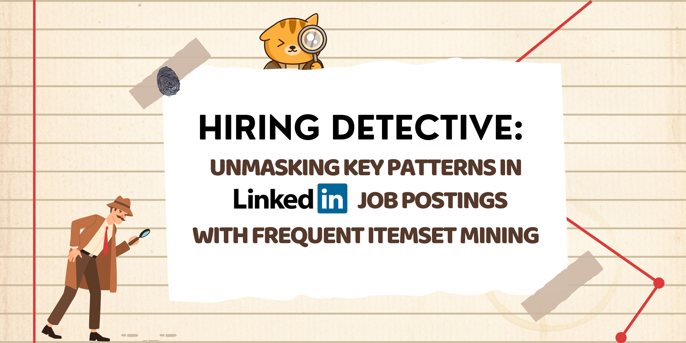
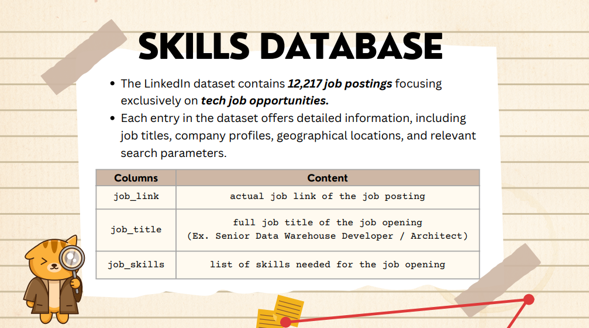
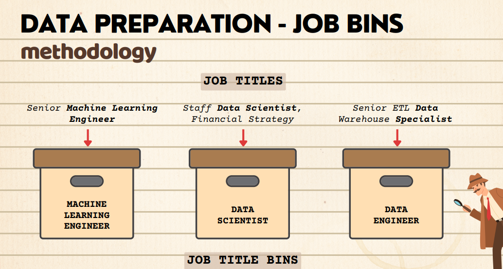
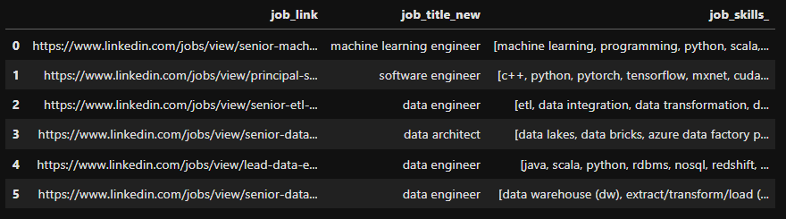
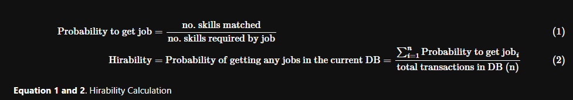
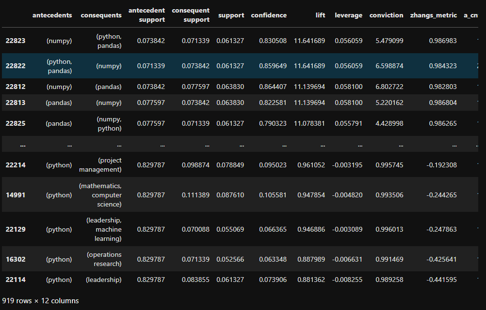

# Data Mining and Wrangling 2 - Final Project



- [Download PDF Presentation](DMW2%20FP%20-%20Presentation.pdf)
- [Download HTML Report](DMW2_FINAL_PROJECT.html)
- [View Notebook](DMW2_FINAL_PROJECT.ipynb)

## Introduction
The job skill mismatch dilemma presents a significant challenge, causing inefficiencies in hiring processes. To mitigate this, a streamlined solution is needed to recommend skills for enhancing applicant hirability and enabling employers to efficiently select and rank candidates with the help of frequent itemset mining (fim) association rules.

## Dataset contents
From [Kaggle LinkedIn Job Postings Dataset](https://www.kaggle.com/code/rajatraj0502/linkedin-job-postings-dataset)




Base Transaction Database:


## Using FIM to Recommend Skills
In this project we'll be using FIM to recommend skills to a person given a base skillset. To recommend we will first create the frequent itemset using `fpgrowth` in `mlexted` library using `mlextend.fpgrowth` function and then getting associated association rules using `mlexted.association_rules` function. From the association rules, we will filter the antecedents based on the input base skills, order the rules by most lift and get top consequents that is unique and not already in the input base skills. We will then define a validation process below.



We'll quote the above metric as `Hirability` based on what skills you have. `Hirability` will be then compared for:

- Base Case (base skills only)
- Stochastic Case (add n randomly sourced skills)
- FIM Case (add n skills with most lift in the association rules)

In this project we'll be using Base Case as the baseline. Stochastic case as the "usual" method of expanding skills (in real life this is not entirely true but we'll use this as some kind of a PCC metric that will define your hirability by adding random skills). Finally, FIM case will be the alternative case. We will then check with the sample cases below the performance of all 3 based on their computed `Hirability`.

We'll look at once example case, other cases are also explored in the notebook and presentation pdf.

### Example Case - Fresh Grad to Data Scientist
- Base Case
```commandline
Skillset: {'numpy', 'python', 'pandas'}
Hirability: 4.006%
Jobs available: 32/799
Applying in all 799 data scientist jobs, you are likely to get into 32
```
- Stochastic Case 
Get hirability when 6 random skills are added to base case, have 100 iterations and get the average
```commandline
Skillset: {'numpy', 'python', 'pandas'} plus 6 random skills, 100 iterations then get average
Hirability: 4.119%
Jobs available: 33/799
Applying in all 799 data scientist jobs, you are likely to get into 33
```
- FIM Case
From the association rules above get top 6 skills consequents with highest lift and add to skills:



```commandline
Skillset: {'numpy', 'python', 'scikitlearn', 'tensorflow', 'sql', 'machine learning', 'r', 'data science', 'pandas'}
Hirability: 15.2374%
Jobs available: 122/799
Applying in all 799 data scientist jobs, you are likely to get into 122
```

### Example Case Validation
Result:

- 4.006 % Hirability (base)
- 4.119 % Hirability (stochastic)
- 15.2374 % Hirability (fim)

Hirability increase better in fim case compared to stochastic case!
